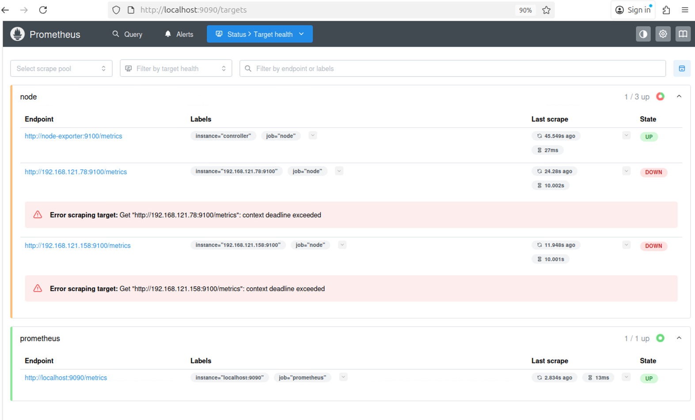
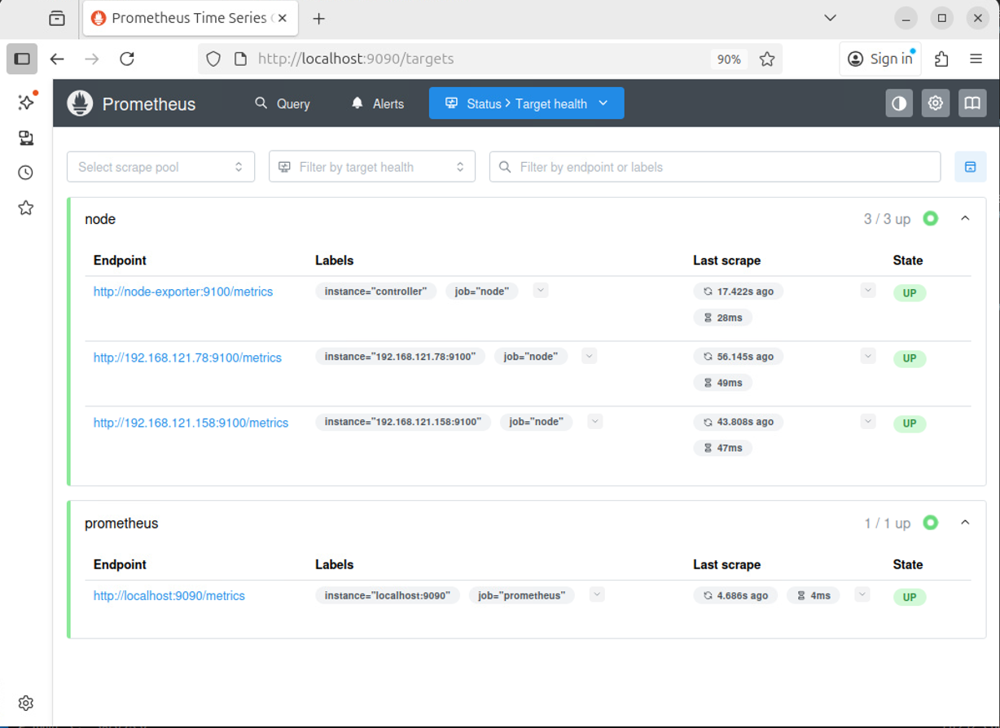

# Examination 15 - Metrics (VG)

[Prometheus](https://prometheus.io/) is a powerful application used for event monitoring and alerting.

[Node Exporter](https://prometheus.io/docs/guides/node-exporter/) collects metrics for Prometheus from
the hardware and the kernel on a machine (virtual or not).

Start by running the Prometheus server and a Node Exporter in containers on your Ansible controller
(the you're running Ansible playbooks from). This can be accomplished with the [prometheus.yml](prometheus.yml)
playbook.

You may need to install [podman](https://podman.io/docs/installation) first.

If everything worked correctly, you should see the data exported from Node Exporter on http://localhost:9090/,
and you can browse this page in a web browser.

# QUESTION A

Make an Ansible playbook, `15-node_exporter.yml` that installs [Node Exporter](https://prometheus.io/download/#node_exporter)
on each of the VMs to export/expose metrics to Prometheus.

Node exporter should be running as a `systemd` service on each of the virtual machines, and
start automatically at boot.

You can find `systemd` unit files that you can use [here](https://github.com/prometheus/node_exporter/tree/master/examples/systemd), along with the requirements regarding users and permissions.

Consider the requirements carefully, and use Ansible modules to create the user, directories, copy files,
etc.

Also, consider the firewall configuration we implemented earlier, and make sure we can talk to the node
exporter port.

HINT: To get the `firewalld` service names available in `firewalld`, you can use

    $ firewall-cmd --get-services

on the `firewalld`-enabled hosts.

Note also that while running the `podman` containers on your host, you may sometimes need to stop and
start them.

    $ podman pod stop prometheus

and

    $ podman pod start prometheus

will get you on the right track, for instance if you've changed any of the Prometheus configuration.

# Resources and Information

* https://github.com/prometheus/node_exporter/tree/master/examples/systemd
* https://prometheus.io/docs/guides/node-exporter/


## Svar

### Fas 1: Konfigurera och starta den centrala Prometheus-servern (datainsamlaren) på kontrollnoden med Podman.

Först installerade jag podman på kontrollnoden för att kunna köra containrar.

```
shilan@shilan-Precision-Tower-3620:~$ sudo apt install podman
```
Därefter redigerade jag den medföljande prometheus.yml-filen för att inkludera IP-adresserna för webserver och dbserver under job_name: 'node':

```
- job_name: 'node'
          static_configs:
            - targets:
                - 'node-exporter:9100'
                - '192.168.121.78:9100'
                - '192.168.121.158:9100'
```
Efter redigeringen körde jag playbooken för att starta Prometheus-servern och den lokala agenten (node-exporter:9100) på kontrollnoden:

```
shilan@shilan-Precision-Tower-3620:~/ansible$ ansible-playbook prometheus.yml 

PLAY [Configure prometheus on your local machine] **************************************************************************************

TASK [Gathering Facts] *****************************************************************************************************************
ok: [localhost]

TASK [Write Prometheus config] *********************************************************************************************************
changed: [localhost]

TASK [Ensure Prometheus container is running] ******************************************************************************************
changed: [localhost]

TASK [Ensure Node Exporter container is running] ***************************************************************************************
changed: [localhost]

PLAY RECAP *****************************************************************************************************************************
localhost                  : ok=4    changed=3    unreachable=0    failed=0    skipped=0    rescued=0    ignored=0   

shilan@shilan-Precision-Tower-3620:~/ansible$
```
En kontroll av Prometheus webbgränssnitt på http://localhost:9090/targets bekräftade att Prometheus-servern fungerade (prometheus och node-exporter var UP), men att den inte kunde nå de fjärrservrar som ännu inte konfigurerats (de var markerade som DOWN):



### Fas 2: Skapa och köra en Ansible Playbook (15-node_exporter.yml) för att installera och konfigurera "agenterna" (node_exporter) på servrarna.

Denna playbook installerar och konfigurerar node_exporter som en systemd-tjänst på alla servrar (hosts: all).

Playbooken utför följande logiska steg:

- Säkerhet: Skapar en dedikerad, oprivilegierad systemanvändare (node_exporter) som tjänsten kan köras som.

- Installation: Laddar ner (get_url) och packar upp (unarchive) den officiella binärfilen från Prometheus GitHub.

- Städning: Tar bort den temporära .tar.gz-filen för att hålla systemet rent.

- Tjänstekonfiguration: Skapar en systemd-enhetsfil (.service) med ansible.builtin.copy och content:. Denna fil instruerar systemet att köra binärfilen som node_exporter-användaren och att starta om den automatiskt (Restart=always).

- Tjänsteaktivering: Tvingar systemd att ladda om sina konfigurationsfiler (daemon_reload: true) så att den nya tjänsten upptäcks. Därefter aktiveras och startas tjänsten.

- Brandväggskonfiguration: Öppnar port 9100/tcp med ansible.builtin.firewalld för att tillåta Prometheus-servern att hämta (pulla) mätvärden.

```
---
- name: Ensure Node Exporter is installed and enabled
  hosts: all
  become: true
  tasks:
    - name: Create node_exporter as a dedicated system user without shell access or home directory
      ansible.builtin.user:
         name: node_exporter
         system: true
         shell: /usr/sbin/nologin
         create_home: false

    - name: Download Node Exporter
      ansible.builtin.get_url:
        url: https://github.com/prometheus/node_exporter/releases/download/v1.8.1/node_exporter-1.8.1.linux-amd64.tar.gz
        dest: /tmp/node_exporter.tar.gz
        mode: "0644"

    - name: Extract Node Exporter to system binary directory
      ansible.builtin.unarchive:
        src: /tmp/node_exporter.tar.gz
        dest: /usr/local/bin/
        remote_src: true
        extra_opts: [--strip-components=1]

    - name: Clean up downloaded tarball
      ansible.builtin.file:
        path: /tmp/node_exporter.tar.gz
        state: absent

    - name: Create Node Exporter systemd service file
      ansible.builtin.copy:
        dest: /etc/systemd/system/node_exporter.service
        content: |
          [Unit]
          Description=Node Exporter
          After=network.target

          [Service]
          User=node_exporter
          ExecStart=/usr/local/bin/node_exporter
          Restart=always

          [Install]
          WantedBy=multi-user.target
        mode: "0644"

    - name: Reload systemd daemon to find Node Exporter service file
      ansible.builtin.systemd:
        daemon_reload: true

    - name: Enable and start Node Exporter
      ansible.builtin.systemd:
        name: node_exporter
        enabled: true
        state: started

    - name: Open Node Exporter port in firewalld
      ansible.builtin.firewalld:
        port: 9100/tcp
        permanent: true
        state: enabled
        immediate: true
        zone: public
```

Playbooken kördes framgångsrikt:
```
shilan@shilan-Precision-Tower-3620:~/ansible$ ansible-playbook 15-node_exporter.yml 

PLAY [Ensure Node Exporter is installed and enabled] ***********************************************************************************

TASK [Gathering Facts] *****************************************************************************************************************
ok: [webserver]
ok: [dbserver]

TASK [Create node_exporter as a dedicated system user without shell access or home directory] ******************************************
changed: [webserver]
changed: [dbserver]

TASK [Download Node Exporter] **********************************************************************************************************
changed: [dbserver]
changed: [webserver]

TASK [Extract Node Exporter to system binary directory] ********************************************************************************
changed: [dbserver]
changed: [webserver]

TASK [Clean up downloaded tarball] *****************************************************************************************************
changed: [webserver]
changed: [dbserver]

TASK [Create Node Exporter systemd service file] ***************************************************************************************
changed: [webserver]
changed: [dbserver]

TASK [Reload systemd daemon to find Node Exporter service file] ************************************************************************
ok: [webserver]
ok: [dbserver]

TASK [Enable and start Node Exporter] **************************************************************************************************
changed: [webserver]
changed: [dbserver]

TASK [Open Node Exporter port in firewalld] ********************************************************************************************
changed: [dbserver]
changed: [webserver]

PLAY RECAP *****************************************************************************************************************************
dbserver                   : ok=9    changed=7    unreachable=0    failed=0    skipped=0    rescued=0    ignored=0   
webserver                  : ok=9    changed=7    unreachable=0    failed=0    skipped=0    rescued=0    ignored=0 
```
### Verifiering
En sista kontroll av Prometheus "Targets"-sida visar nu att agenterna på webserver (192.168.121.78:9100) och dbserver (192.168.121.158:9100) har status UP (Grön).

Detta bekräftar att Prometheus-servern nu framgångsrikt hämtar (pullar) mätvärden från alla servrar.

